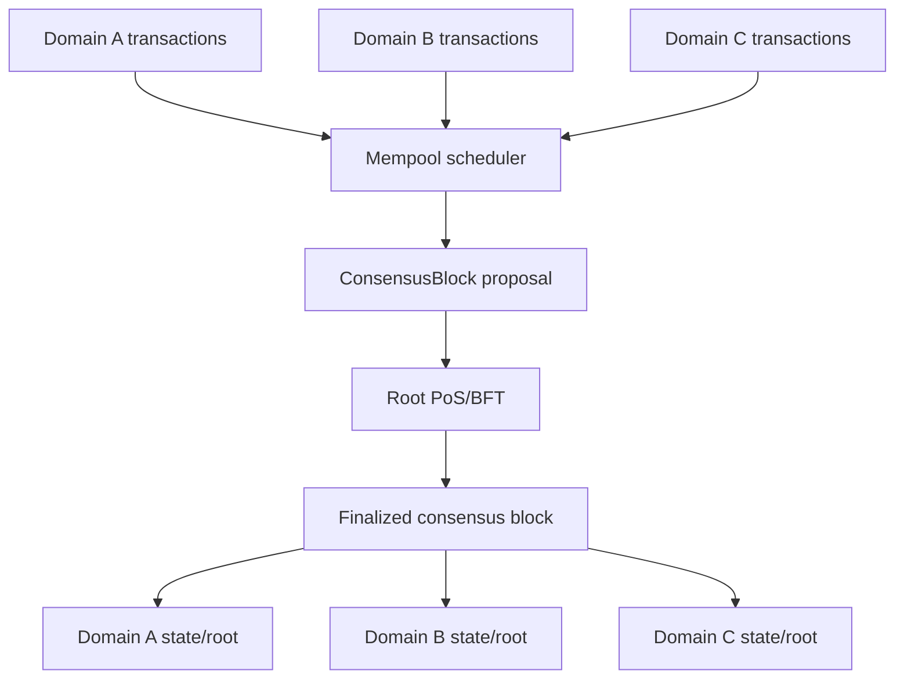

# Arbor Rust 架构设计

## 1. 目标与协议边界

Arbor 用 Rust 实现 FnFnCoreWallet 的核心思想：一条安全根链承载可继续分裂的树形子链。Arbor 复用的是“父链、创建锚点、子链、谱系”语义，不兼容旧节点的 UTXO、Template、PoW/DPoS、PVSS/MPVSS、数据库或线协议。

已经确定的边界：

1. 使用 Ethereum 风格账户模型和 EVM，不使用 UTXO。
2. 状态和节点数据持久化到 parity-db，不复用原项目 LevelDB 封装。
3. 生产共识为 PoS + BFT 确定性最终性；MPVSS/PVSS 和挖矿不进入生产路径。
4. 用户通过标准签名交易调用系统合约，不存在 Template、模板地址或 `makeorigin` 流程。
5. 不使用 Substrate、Cosmos SDK 等区块链框架；通用能力优先采用成熟 Rust crate。
6. v1 不追求与 FnFnCoreWallet 的哈希、地址、序列化或网络兼容。旧代码只用于提取业务语义和测试场景。

为避免“fork”同时表示子链和共识临时分支，Arbor 协议和用户接口统一称树中的链为 **domain（逻辑子链）**。文档仅在描述原 C++ 类型时使用 fork。

## 2. 从 C++ 项目保留与舍弃的内容

| 原 C++ 机制 | Arbor 决策 | 原因 |
| --- | --- | --- |
| `CProfile`、`CForkContext` 的 parent/joint/genealogy | 保留语义，重构为 `DomainDescriptor` | 这是树形链的核心业务语义 |
| fork Template 交易内嵌 origin block | 改为根 domain 调用 `ChainRegistry.create_chain(parent, ...)` | 普通账户交易、全局唯一 registry、无需模板钱包 |
| isolated/private/enclosed flags | v1 不迁移 | 其状态继承、网络可见性和准入语义混杂；公开 BFT 网络无法提供数据隐私 |
| `ForkManager` allow/group list | 仅保留为节点本地订阅策略 | 原代码的 `IsAllowedFork` 是本地激活策略，不能成为共识有效性规则 |
| `Primary/Subsidiary/Extended/Vacant` 与 piggyback proof | 不迁移 | 它们服务于旧 DPoS 时钟、委托票选和子链补高，不适用于新共享 BFT finality |
| UTXO、Template、多签/weighted Template | 不迁移 | 由账户、EVM 合约钱包和治理合约替代 |
| LevelDB block view、wallet DB | 不迁移格式 | parity-db + authenticated state + 独立 keystore |

原项目中需要继续参考的代码集中在：

- `common/profile.*`、`common/forkcontext.h`：子链元数据和 parent/joint。
- `src/forkmanager.cpp`：子链发现、本地激活和谱系遍历。
- `src/worldline.cpp`、`storage/blockbase.*`：多链索引和状态视图。
- `src/dispatcher.cpp`：origin 激活和网络订阅。

## 3. 核心决策：根共识下的共享安全子链

### 3.1 为什么不能直接照搬“每条子链独立出块”

若每创建一条子链就启动一套 PoS/BFT，会立即产生未定义问题：验证者从哪里来、质押在哪条链、子链少量质押如何防攻击、跨链如何确认最终性、节点是否必须同时参加无限多个共识实例。现有设计不能把这些问题留给实现阶段。

Arbor v1 采用一个安全域：根链 validator set 对 `ConsensusBlock` 达成 BFT 共识；每个共识块可携带多个 domain 的交易批次。所有 active domain 共享根链最终性，不各自运行 BFT。

这里有两层不同对象：**共识链**只负责排序、最终性和 validator transition，不直接作为 EVM 链；**根 domain** 是 genesis 时创建的第一个 EVM domain，承载 `ChainRegistry`、staking 和 governance 控制面。普通子链与根 domain 使用相同 EVM 执行规则，但不能拥有独立 validator set。



该模型提供：

- 一套 validator set、一份 QC/finality proof 和统一 validator 生命周期。
- 每个 domain 独立状态、原生资产、EVM chain ID、gas 参数和逻辑区块序列。
- domain block 通过共识块中的 Merkle inclusion proof 继承最终性。
- 没有交易的 domain 不增长高度，不需要 `Vacant` block。

v1 的代价是所有验证者都必须执行被提议的所有 domain batch，因此“可无限分裂”表示协议谱系无固定深度，不表示资源无限。协议必须限制单块 active batch 数、每个 domain gas、总 block gas/bytes，并用创建押金和可选状态租金控制垃圾子链。独立子链委员会、数据可用性分片或 parent checkpointing 属于后续安全模型，不能以配置开关混入 v1。

### 3.2 共识块和 domain block

```text
ConsensusBlockHeader {
  protocol_version,
  network_id,
  height,
  parent_hash,
  timestamp,
  batches_root,
  domain_results_root,
  domain_heads_root,
  validator_set_hash,
  next_validator_set_hash,
  proposer,
}

DomainBatch {
  domain_id,
  parent_domain_block_hash,
  transactions,
}

DomainBlockHeader {
  protocol_version,
  domain_id,
  number,
  parent_hash,
  consensus_height,
  transactions_root,
  state_root,
  receipts_root,
  logs_bloom,
  gas_limit,
  gas_used,
  base_fee_per_gas,
}
```

`ConsensusBlock` 中的 batch 按 `domain_id` 排序，同一 domain 最多一个 batch。batch 内交易顺序由 proposer 给出并由所有验证者重放。`domain_results_root` 承诺本块产生的结果，`domain_heads_root` 是 `domain_id -> (domain block hash, state root)` 的全量稀疏承诺，未执行 domain 的 leaf 保持不变。`DomainBlockHeader` 不包含 `ConsensusBlock` 自身哈希，避免循环哈希。

某个 domain block 的最终性证明由 `(ConsensusBlock, QC, domain result inclusion proof)` 组成；某 checkpoint 时 domain 当前 head/state 的证明使用 `(ConsensusBlock, QC, domain heads proof)`。两者不可混用。

domain 的 EVM `block.number` 是该 domain 的逻辑序号，只在 domain batch 被包含时增长；`block.timestamp` 使用承载它的共识块 timestamp。长时间空闲的 domain 不产生虚拟高度，base fee 也不变化。这是 v1 明确语义，不宣称与固定 slot 的 Ethereum block cadence 相同。

节点只把 committed state 标记为 canonical。BFT adapter 可按恢复要求持久化未提交 proposal、QC 和 overlay 引用，但不得移动 finalized head；丢弃 proposal 时释放 overlay 并回补 mempool。BFT 已提交块不可重组，文档和 API 不再承诺对 finalized state 执行 reorg。

M5 已将这条边界实现为 `ValidatedProposal`：构造阶段只保留私有执行 overlay 并 reserve mempool 条目；一次同步 parity-db transaction 原子写 block body、state/code、receipt/index、development WAL、domain head 与 finalized marker 后，才替换内存 finalized view 并发布 `CommitEvent`。恢复时从 genesis 重放持久化 block，并要求重放 head、marker、domain state head 与 WAL 完全一致。精确集合根、base fee、`PREVRANDAO` 和 body codec 见 [block protocol](protocol/blocks.md)。

M6 在同一边界上加入 root-only `ChainRegistry`：proposal 开始时一次性捕获所有 finalized domain head，创建、押金 refund/burn 的 value、registry storage 和 event 在同一 `revm` journal 内成功或回滚；finalization transaction 同时写新 domain genesis state、descriptor 查询投影和全局 marker。新 domain 只可从下一共识高度进入 batch。精确 ABI、押金生命周期、scheduler、local history projection 和 proof 规则见 [domain protocol](protocol/domains.md)。

## 4. Domain 创建与生命周期

### 4.1 用户流程

所有 domain 生命周期操作都在根 domain 上执行。用户向根 domain 的保留系统 precompile 地址 `ChainRegistry` 发送普通 EIP-1559 交易；请求中的 `parent_domain_id` 可以指向任意 active domain。这样 domain registry、EVM chain ID 唯一性和创建押金只有一个共识真值，不需要跨 domain 写状态。

```text
create_chain(CreateChainRequest {
  parent_domain_id,
  name,
  symbol,
  evm_chain_id,
  owner,
  gas_limit,
  initial_base_fee,
  initial_supply,
  protocol_revision,
})
```

CLI 提供高层入口并在本地签名：

```bash
arbor chain create \
  --parent <domain-id> \
  --name demo \
  --symbol DMO \
  --evm-chain-id 2048 \
  --initial-supply 1000000000 \
  --owner <address>
```

RPC 只负责构造 calldata、估算 gas、广播 raw transaction 和查询结果；节点默认不保管或解锁用户私钥。

### 4.2 确定性标识和创建锚点

- `domain_id = keccak256("ARBOR_DOMAIN_V1" || canonical_codec_version || network_id || parent_domain_id || create_tx_hash)`。
- `joint` 不由用户任意指定，而是 proposal 开始执行时 parent domain 的 finalized head。即使 parent 在同一共识块也有 batch，创建仍锚定前一 finalized head，避免执行顺序造成歧义。
- `origin_hash = keccak256(canonical(DomainGenesis))`，由创建请求、`domain_id`、parent、joint 和初始状态根唯一确定。
- 新 domain 在创建交易所在共识块 finalized 后登记，在下一个共识高度起可接收交易。
- `(parent_domain_id, create_tx_hash)` 唯一，重放或重复执行必须得到同一结果。
- `evm_chain_id` 在整个 Arbor network 内唯一且不可修改；注册表拒绝冲突。
- `name` 和 `symbol` 只是经过长度/字符规范化的展示元数据，不作为安全标识，允许重复；CLI/RPC 的精确引用始终使用 `domain_id` 或唯一 `evm_chain_id`。

`DomainDescriptor`：

```text
DomainDescriptor {
  domain_id,
  parent_domain_id,
  joint_domain_block_hash,
  create_tx_hash,
  origin_hash,
  name,
  symbol,
  evm_chain_id,
  owner,
  protocol_revision,
  gas_limit,
  initial_base_fee,
  initial_supply,
  creation_deposit,
  status: Pending | Active | Frozen,
}
```

所有子链从空状态开始，只预部署版本化系统合约并向 `owner` 分配 `initial_supply`。不隐式复制 parent 的账户、合约或余额；资产跨 domain 转移必须等待单独设计的消息/桥协议。创建押金使用根 domain 原生资产并锁在根 `ChainRegistry`，用于抗垃圾创建；锁定期、退还、罚没和最低金额是根治理参数，不由 CLI 自行估算规则。

`owner` 在 v1 只能轮换 owner 和更新展示 metadata，不能修改 chain ID、initial supply、历史 joint、交易有效性或共识。冻结 domain、调整 gas limit 和升级 protocol revision 只能由根治理在未来共识高度执行。`ChainRegistry`、`Staking` 和 `Governance` 的控制面真值只在根 domain；其他 domain 上相同保留地址不得伪装成根控制面。v1 不提供私有链或 permissioned mempool；准入控制以后由合约实现。

BFT 保证已提议 block 的一致排序和最终性，不自动保证任意 domain 交易的及时包含。v1 依赖 leader rotation、honest proposer 和本地公平 scheduler 缓解审查；严格 inclusion list 或抗审查机制不在 v1。

### 4.3 本地订阅不是共识授权

节点通过 `node.domains = "all|root,<id>..."` 决定保存哪些 domain 的派生 receipt/transaction-location 历史索引；后续 M7/M9 可在同一边界增加 body/log/RPC 历史服务。validator/full verifier 必须保存所有 active domain 的最新可执行状态，并取得、执行当前共识块的全部 batch。只验证 header/proof 的 light node 可以不保存状态，但不能宣称完成 execution validation。订阅过滤不能影响 block validity、domain 是否存在或 domain 状态根，否则不同配置的节点会产生共识分裂。

## 5. 账户、交易与 EVM

### 5.1 账户状态

v1 使用 Ethereum 账户叶子语义：

```text
Account {
  nonce: u64,
  balance: U256,
  storage_root: B256,
  code_hash: B256,
}
```

不在账户叶子加入 `account_kind` 或可选字段。EOA、合约和系统地址通过 code/system address registry 判定；空 code 和空 storage 使用协议定义常量。这样可直接映射 `revm`，并避免后续迁移状态根格式。

系统功能实现为保留地址上的 native system contract（stateful precompile）：对用户暴露稳定 ABI，由 executor 拦截调用并通过同一 journal 写普通 EVM account/storage，因此成功结果进入 state root 和 receipt/log，外层 revert 也必须完整回滚。它不是旧 Template，也不是节点本地配置。precompile 地址、ABI hash、gas schedule 和实现版本由 `ProtocolSpec` 固定。

M4 首个 registry 版本只启用只读 `protocolInfo()`：地址 `0x0000000000000000000000000000000000000800`、selector `0x93420cf4`、native execution gas 500。它通过 `revm` 的 `PrecompileProvider` 执行，错误 calldata 或非零 value 走 EVM revert；不能在 EVM 外手工修改 nonce、费用或余额。返回 ABI words 为 `(protocol_revision, evm_revision, registry_version, chain_id)`。

M6 在 root domain 启用 `ChainRegistry` 地址 `0x0000000000000000000000000000000000000801`。`createChain`、owner `refundDeposit` 和 root-governance `burnDeposit` 的押金转账、descriptor/chain-ID/deposit slots、terminal status 和事件全部走同一 `revm` journal；其他 domain 上该地址不能写 root 控制面。ABI 和固定 gas 见 [domain protocol](protocol/domains.md)。

### 5.2 交易 envelope

用户交易从第一版采用 EIP-2718 typed envelope，v1 至少支持 EIP-1559 type-2 transaction：

- `chain_id` 等于目标 domain 的唯一 `evm_chain_id`，提供跨 domain replay protection。
- native transfer、contract create、contract call 和 system contract call 使用同一 envelope。
- sender 由 secp256k1 签名恢复；`tx_hash` 使用标准 Ethereum typed transaction Keccak hash。
- 不再定义另一个 BLAKE2 `txid`，也不同时暴露两个交易主键。
- 共识奖励、slash、epoch 切换和 genesis allocation 是确定性 system transition，不伪装成用户交易。

交易预检只做不依赖执行结果的检查。余额、nonce、intrinsic gas、base fee、EVM revision 和访问列表规则以目标 domain 当前 finalized state 为准。mempool 按 `(domain_id, sender, nonce)` 管理 pending/queued transaction，replacement 策略必须版本化并与 block validity 解耦。

gas 使用目标 domain 的原生资产支付。base fee 按协议公式销毁，priority fee 记入 proposer 在该 domain 的 reward address；根 PoS epoch reward 只使用根 domain 资产。genesis allocation、burn、reward 和 slash 都进入逐 domain supply invariant 测试。

共识块 timestamp 由 proposer 提议，必须严格大于 parent timestamp，并满足 `ProtocolSpec` 的最大步进；状态转换不读取本机时钟。节点可用本地时钟决定暂缓转发明显超前的 proposal，但本地配置不能改变最终 block validity。

### 5.3 执行和失败语义

`arbor-executor` 统一执行交易，`arbor-evm` 封装 `revm`：

```text
execute_batch(
  domain_env,
  parent_state_root,
  transactions,
  state_overlay,
) -> DomainExecutionResult
```

每笔交易先扣除可支付 gas 上限并增加 nonce；EVM revert 回滚 value/code/storage/log 变更，但保留 nonce 和实际 gas 费用。区块级无效与交易执行失败必须区分：签名、chain ID、nonce 顺序或 block gas 超限使 proposal 无效；合约 revert 产生 `status = 0` receipt，不使整个 block 无效。

EVM revision、opcode/gas schedule、base fee 公式、block env 字段和 system contract 版本由 `protocol_revision` 固定。升级必须在已知共识高度激活，不能跟随节点安装的 `revm` 版本自动变化。

protocol revision 1 精确映射 `revm` 41.0.0 的 Shanghai `SpecId`，不是 `revm::SpecId::default()` 或 `LATEST/NEXT`。执行输入显式给出 domain number、consensus timestamp、beneficiary、gas limit、base fee 和 prevrandao；adapter 固定 chain ID/code/initcode limits，并保持 Ethereum nonce、balance、intrinsic gas、refund、base-fee burn 和 priority-fee reward 检查。每个 batch 从 parent `ExecutionState` clone 开始，block-invalid 错误丢弃 clone；EVM revert/halt 则应用 `revm` journal 中保留的 nonce 和实际 gas 费用。

### 5.4 Receipt 和日志

共识 receipt 采用 Ethereum 兼容字段和编码：status、cumulative gas used、logs bloom、logs。`contract_address`、单笔 `gas_used` 和 revert reason 可作为 RPC 派生字段。`state_diff_hash` 可用于调试索引，但不进入 Ethereum receipt root。

交易根、receipt 根、logs bloom、空 trie root 和 trie key 编码必须在协议规范中给出算法和黄金向量，不能只写“Merkle root”。

M4 直接以原始 EIP-2718 envelope 和 typed receipt bytes 调用 Ethereum ordered MPT：key 是 `RLP(transaction_index)`，value 不加 Arbor wrapper。receipt bloom 对每个 log address/topic 使用 Ethereum 2048-bit bloom，block bloom 是 receipt bloom 的 OR；RPC-only output、contract address、单笔 gas 和 revert data 不进入 receipt root。精确规则和向量见 [execution protocol](protocol/execution.md)。

## 6. 状态承诺与 parity-db

parity-db 是持久化引擎，不是状态根算法。Arbor 使用独立的 authenticated state commitment：v1 实现 Ethereum Merkle Patricia Trie（Keccak + RLP）承诺 domain account/storage，以获得最直接的 EVM proof 语义；M0 已验证 `alloy-trie` 的 root/proof 与增量内容节点写入，并使用 parity-db 的 hash/B-tree columns 保存 node store 和元数据。若未来改用 sparse Merkle tree 作为账户树，必须通过 ADR 明确承认其 `eth_getProof` 和 Ethereum state root 不兼容。`domain_heads_root` 使用独立、固定 key/value 编码的 sparse Merkle map，不改变 domain 内 Ethereum state root。

M3 的 production MPT materializer 输出标准 Ethereum RLP leaf/extension/branch node，把每个 node 按 Keccak content hash 存储，并用 `alloy-trie` 独立复核 root/proof。secure account/storage key 的 preimage 不可从 trie 反推，因此可重建 flat cache 以 `(domain_id, secure_key)` 为键；地址/slot 查询先计算 secure key。`domain_heads_root` 的 present/empty leaf 与逐层 branch 编码由 ADR-003 固定，proof 必须恰有 256 个 root-to-leaf sibling。

合约账户叶子只承诺 `storage_root`，因此 durable manifest 还必须携带当前账户引用的每棵 storage trie 的 content nodes；只保存 account trie nodes 会在重启后得到表面可达但不可执行的 state root。M4 `ExecutionState` 用 raw address/slot 在访问时计算 secure key，从 account leaf 取得 storage root，再从同一 node store 加载 storage leaf；提交后的 `db inspect` 同时遍历 account/storage roots 并校验当前 code hash 可加载。

建议 column families：

| CF | 内容 |
| --- | --- |
| `meta` | schema version、network/genesis id、commit marker |
| `consensus_blocks` / `consensus_index` | finalized 共识块、height/hash 索引 |
| `domain_blocks` / `domain_index` | domain header/body、number/hash 索引 |
| `domain_registry` / `domain_head` | descriptor 查询索引、finalized head 和 heads commitment node |
| `trie_nodes` | 按 node hash 保存不可变 authenticated trie node |
| `contract_code` | code hash 到 bytecode |
| `receipts` / `logs` / `tx_index` | receipt、可选日志索引、交易位置 |
| `consensus_wal` | last signed、round/view、QC/lock/commit safety state |
| `staking_index` | 从 finalized root state 派生的查询缓存，可重建 |
| `mempool` | 可选本地持久化，不属于共识状态 |

账户和 storage 的真值来自 `state_root + trie_nodes`；domain descriptor 的共识真值来自根 domain `ChainRegistry` storage。`domain_registry`、`staking_index` 和 flat account/storage table 只是可重建查询缓存，不能与 trie 形成双重真值。

提交协议：

1. 在 parent root 上创建 overlay，执行并计算所有 domain result。
2. 验证 proposal 后保存未提交 block/QC 所需数据，但不移动 finalized head。
3. 收到 BFT commit 后，用一个开启 `sync_wal` 与 `sync_data` 的 parity-db transaction 原子写入 immutable trie nodes、block/receipt/index、commit marker 和 heads。
4. 重启时以 commit marker 检测不完整提交，重放 consensus WAL，校验 head 对应 root 可达。
5. consensus safety state 必须在签 vote 前 durable；不能等 block finalized 后才写入，否则崩溃重启可能双签。

协议 commit 一旦 parity-db transaction 成功就必须向上层报告 durable success；随后 full-mode GC 失败只能标记为待重试，不能把已提交高度返回成失败并诱导调用方重复提交。

存储模式：

- `archive`：保留所有历史 trie node、body、receipt 和日志索引。
- `full`：保留 finalized block 和最近状态，按 retention window 做 trie GC。
- snapshot/checkpoint 必须包含共识高度、validator set、`domain_heads_root`、每个导入 domain 的 heads proof 和 finality proof；导入后逐项校验。

钱包 keystore 不存入节点共识数据库。CLI 使用独立目录和带版本的加密 keystore；RPC 默认不暴露解锁、签名或 `stop` 管理能力。

## 7. PoS/BFT 共识

### 7.1 安全假设

- 同一 epoch 中 Byzantine voting power 严格小于总权重的 1/3。
- 在最终同步网络假设下获得 liveness；网络长期分区时优先保持 safety。
- validator set 只从 finalized 根 domain 状态派生，在 epoch 边界生效。
- validator set 更新必须由旧 set finalization 覆盖，并在 header 中承诺 `next_validator_set_hash`。
- 所有共识签名包含 `network_id`、height、round/view、phase 和 block hash 域分离，防止跨网络/阶段重放。
- v1 consensus key 使用独立于账户 key 的 secp256k1 keypair；公钥为 33-byte compressed SEC1，签名为 canonical low-s 64-byte `(r,s)`。即使曲线相同，也禁止复用账户私钥。

### 7.2 库选型边界

调研快照（2026-07-15）：

| 候选 | 当前判断 |
| --- | --- |
| Malachite | 第一优先 spike。活跃维护，Tendermint library、WAL、network/sync 分层较完整，并被用于 Circle Arc；但官方仍标记 alpha、未外部审计，production 前必须压测和审计。crate 已迁移为 `arc-malachitebft-*`。 |
| `hotstuff_rs` | 第二 spike。提供 pluggable App/KVStore/Network、block sync 和动态 validator set；公开 crate 0.4.0 较旧，需确认维护节奏、运行时模型和持久化语义。 |
| `aleph-bft` / `finality-grandpa` | 仅作为 finality gadget 参考；它们没有替 Arbor 解决完整 block production、PoS 和多 domain 排序。 |

不在架构文档中提前宣称某个 alpha crate 已可生产。M0 用同一 `ConsensusApplication` 测试夹具做两个短 spike，ADR 根据安全存储、恢复、动态 validator、网络适配、可观测性、许可证和维护情况选定一个实现。

项目内部边界只暴露应用语义：

```text
ConsensusApplication {
  build_proposal(parent, limits) -> CandidateBlock
  validate_proposal(parent, candidate) -> ValidatedBlock
  on_commit(committed_block, finality_proof)
  validator_set(at_finalized_root) -> ValidatorSet
}

ConsensusSafetyStore {
  load_round_state()
  persist_before_vote(round_state, signed_vote)
  commit_qc(qc)
}
```

mempool 提交、P2P peer 管理和 parity-db schema 不属于 `ConsensusEngine` 领域 trait。adapter 可以转换第三方类型，但第三方 block/vote 类型不得泄漏到 state、executor、RPC。

### 7.3 v1 staking 范围

v1 先支持 self-bond validator，暂不实现委托、commission 和流动质押：

- `register_validator(consensus_pubkey, self_bond, metadata)`
- `add_bond(amount)`
- `begin_unbond(amount)`，生成带 completion epoch 的多条 unbond entry
- `withdraw_unbonded()`
- `rotate_consensus_key(new_key)`，延迟到 epoch 边界且全局唯一
- `unjail()`，仅适用于允许恢复的 downtime jail
- `submit_evidence(evidence)`

协议参数必须明确：最小 self-bond、最大 active validators、power 换算与截断、epoch 长度、unbonding/slashing window、evidence 最大年龄、double-sign slash、downtime window、奖励分配和通胀。double-sign safety violation 应 tombstone，不能简单自动解 jail。

staking、validator set 和治理交易只允许在根 domain 执行；子链原生资产不能直接获得根共识 voting power。

validator signer 在签名前持久化 `(height, round/view, phase, block_hash)`，拒绝冲突签名。远程 signer/HSM 是发布前安全项。

M5 的 `SingleValidatorEngine` 仅在显式 `--dev-validator` 且 data directory 由 `node init --dev` 初始化时可用；它本地验证后立即 commit，不产生 vote/QC，也不声称 Byzantine safety。其 production mode 是硬失败，因此这条开发路径不能绕过 ADR-004 或解除 M8 阻塞。

M6 扩展该开发引擎为按 active domain 隔离 mempool、轮转公平份额并构造多 batch，但这仍只是 honest proposer policy 和本地立即最终化；它不新增 vote/QC，也不构成 censorship resistance 或 BFT 证据。

## 8. 网络与同步

从第一版使用 `rust-libp2p`，不先写一套临时 TCP 协议再替换。网络分三类：

- discovery/identity：`identify`、Kademlia、mDNS、ping。
- gossip：交易和已 finalized block announcement；按 domain topic 分流并限制速率。
- authenticated direct protocol：proposal、vote、round-change、block sync、state sync。共识 vote 不使用无目标全网 gossip。

libp2p peer identity 与 validator consensus identity 分离；握手绑定 network/genesis id、protocol versions、角色和支持能力。validator 消息额外验证当前 epoch consensus key。

同步分级：

1. header/finality sync：验证 validator-set transition 和 QC 链。
2. block/body sync：下载共识块、domain batch、receipt。
3. state snapshot sync：从已验证 checkpoint 导入 trie nodes，再执行后续块。
4. domain history sync：非 validator 可按订阅补充历史 body/log，不影响共识状态。

所有 frame 有长度上限、超时、版本、请求 id 和解码预算。peer penalty 只影响本地连接，不改变协议有效性。

## 9. 模块组织

```text
crates/
  arbor-primitives/   # network/domain ids、headers、tx/receipt、validator types
  arbor-codec/        # 共识 canonical codec、RLP/EIP-2718、黄金向量
  arbor-crypto/       # Keccak、secp256k1、consensus signature、domain separation
  arbor-state/        # authenticated trie、overlay、snapshot、pruning
  arbor-storage/      # parity-db schema、transaction、migration、recovery
  arbor-evm/          # revm adapter、revision、block/tx env
  arbor-system/       # ChainRegistry、Staking、Governance system contracts
  arbor-executor/     # domain batch transition、fees、receipts
  arbor-chain/        # consensus/domain block validation 和 finality proof
  arbor-mempool/      # per-domain nonce queues、replacement、limits
  arbor-consensus/    # BFT adapter、PoS set、safety store
  arbor-network/      # libp2p protocols、sync、peer policy
  arbor-rpc/          # Ethereum JSON-RPC + arbor namespace
  arbor-keystore/     # 独立本地 keystore，不依赖 node DB
  arbor-node/         # 生命周期、任务监督、依赖装配
  arbor-cli/          # 本地签名和 RPC client
  arbor-testkit/      # genesis、模拟网络、多进程 e2e、fault injection
```

`arbor-node` 负责装配，不包含协议规则。执行层只接收显式 block/domain env；读取系统时间、随机数、网络或本地配置都不得影响状态转换。

## 10. RPC 与用户体验

RPC 使用 JSON-RPC 2.0 over HTTP/WebSocket。方法分为：

- 标准 Ethereum：`eth_chainId`、`eth_getBalance`、`eth_getTransactionCount`、`eth_call`、`eth_estimateGas`、`eth_sendRawTransaction`、`eth_getTransactionReceipt`、`eth_getLogs` 等。
- Arbor 查询：`arbor_getDomain`、`arbor_listDomains`、`arbor_getGenealogy`、`arbor_getFinalityProof`、`arbor_getValidatorSet`。
- Arbor 构造 helper：`arbor_buildCreateChainTransaction` 返回 `to/data/value/gas`，由 CLI 或外部钱包签名。

每个 RPC endpoint 绑定一个默认 domain，也允许显式 domain routing；不能根据同一个 `eth_chainId` 返回多个 domain。公开 endpoint 默认禁用管理方法、任意文件访问、私钥操作和节点停止。

高层 CLI：

```bash
arbor node init --dev --data-dir ./data/node1
arbor node run --dev-validator --data-dir ./data/node1
arbor account new
arbor tx send --domain root --to <address> --value 1
arbor chain create --parent root --name demo --symbol DMO --evm-chain-id 2048
arbor chain tree
arbor consensus status
```

## 11. 升级、资源和安全

所有会改变状态转换的参数放入版本化 `ProtocolSpec`：codec、EVM revision、gas schedule、system precompile ABI/版本、fee 公式、block limits、staking/slashing 参数。治理只可安排未来高度/epoch 的已知升级，节点必须能在激活前验证目标 spec；未知版本停止跟链，不能猜测执行。

必须在实现前固定的资源上限包括 transaction bytes、calldata/code/initcode、access list、logs、batch 数、单 domain gas、共识块总 gas/bytes、RPC body、P2P frame、解码深度和 snapshot chunk。

威胁模型至少覆盖：

- BFT equivocation、long-range attack、validator key compromise 和 weak subjectivity checkpoint。
- chain creation spam、名称抢注、`evm_chain_id` 冲突和押金经济攻击。
- EVM 重入、system contract 权限、升级和 gas DoS。
- parity-db 日志/节点损坏、崩溃时双签、snapshot 投毒和索引与状态根不一致。
- RPC key exposure、日志泄密、P2P eclipse/resource exhaustion。

## 12. 测试策略

- 规范/黄金向量：EIP-2718 hash、signing payload、trie/state root、receipt root、domain id、origin hash、header hash、vote/QC 域分离。
- 状态测试：Ethereum execution/state tests 的固定子集，system contract 状态机和 upgrade boundary。
- 属性测试：余额/供给、nonce、gas、domain genealogy、创建幂等、validator power 和 unbond/slash 时序。
- 存储测试：每个提交阶段注入崩溃，重启后 root/head/WAL 一致；archive/full pruning 和 snapshot round-trip。
- 共识测试：确定性模拟网络覆盖掉包、乱序、延迟、节点重启、少于 1/3 Byzantine power、validator set transition 和双签保护。
- e2e：4 validator + 多 domain，创建子链、EVM 调用、落后同步、snapshot 恢复和 finality inclusion proof。
- fuzz：canonical decoder、RLP、ABI/system calls、P2P frame、RPC、snapshot chunk。

覆盖率是辅助指标。协议关键状态机要求分支和不变量测试，不能仅用全仓行覆盖率替代。

## 13. 明确不在 v1 的内容

- 旧节点、旧钱包、旧地址、旧数据库和旧网络互通。
- UTXO、Template、PoW、DPoS、PVSS/MPVSS、mining RPC。
- `Extended`、`Piggyback`、`Vacant` block。
- 私有/隐藏子链、每子链独立 validator set、跨 domain 原子交易。
- trustless bridge、异步跨 domain message、轻客户端证明和外部链桥。
- delegated staking、liquid staking、MEV/PBS 和 data availability sampling。

这些能力若进入后续版本，必须先有独立 ADR、威胁模型和迁移方案。

## 14. 主要风险

| 风险 | 缓解 |
| --- | --- |
| Rust BFT 库仍处早期阶段 | M0 双 spike；内部边界隔离；模拟网络、恢复和安全存储作为硬门槛 |
| 共享执行限制 domain 扩展性 | 明确 v1 上限；按 domain gas 配额；后续安全模型单独设计 |
| parity-db 与 authenticated trie 被误当成同一层 | `StateCommitment`/node store 分层；根和 proof 黄金向量 |
| EVM crate 升级改变共识 | pin 版本；`ProtocolSpec` 固定 revision；升级跑 state tests |
| 共识 WAL 与应用提交崩溃不一致 | 签名前 durable safety state；commit marker；阶段性 crash injection |
| 子链创建和初始供给可被滥用 | root-governed deposit、资源上限、唯一 ID、明确 supply 规则 |

## 15. 参考

- FnFnCoreWallet: `/home/mathxh/project/FnFnCoreWallet`
- Malachite: https://github.com/circlefin/malachite
- HotStuff-rs: https://docs.rs/hotstuff_rs/latest/hotstuff_rs/
- rust-libp2p: https://github.com/libp2p/rust-libp2p
- parity-db: https://github.com/paritytech/parity-db
- revm: https://github.com/bluealloy/revm
- alloy: https://github.com/alloy-rs/alloy
- Ethereum execution specs: https://github.com/ethereum/execution-specs
