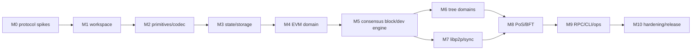

# Arbor Rust 实施规划

## 当前状态（2026-07-15）

- M0：进行中。ADR-001、002、005 已接受；协议常量、威胁模型、资源预算和兼容性政策已有初版；state 与共识共享 harness 已落地。ADR-003 仍等待增量 trie/pruning/crash benchmark 门禁，ADR-004 仍等待两个候选各自的 live 4-process 故障与 WAL 重启测试。
- M1：完成。Rust 2024/stable workspace、17 个架构 crate、单一 `arbor` 入口、配置/错误分类/tracing/任务监督/graceful shutdown、`arbor-testkit` 与 CI 门禁已落地并通过本地 fmt、Clippy 和 workspace test。
- M2 及以后：未开始；不得绕过 M0 的 Proposed ADR 硬门槛提前固化 trie/BFT 生产依赖。

## 1. 交付目标

v1 交付一个可本地运行、可多节点验证、可创建树形逻辑子链并执行 EVM 合约的 Rust 区块链：

- 根 PoS/BFT 共识对所有 domain 提供共享确定性最终性。
- 每个 domain 有独立 EVM chain ID、账户状态、原生资产和逻辑区块序列。
- 用户用 EIP-1559 交易调用 `ChainRegistry` 创建子链，不接触 Template 或 origin 编码。
- RocksDB 保存 block、authenticated trie、receipt、consensus WAL 和索引。
- 4-validator devnet 可容忍少于 1/3 voting power 故障，支持重启和落后同步。
- CLI 本地管理 keystore 和签名；节点 RPC 默认不持有用户私钥。

v1 不交付旧节点兼容、UTXO、Template、PoW/DPoS、PVSS/MPVSS、每子链独立共识、私有子链、`Extended/Piggyback/Vacant` block 或跨 domain bridge。

## 2. 推进原则

1. 先冻结会影响全仓的数据和安全决策，再搭大规模代码框架。
2. 按可运行的垂直切片推进：canonical type -> state -> execution -> block -> network -> BFT。
3. 共识和状态存储都先做 spike；不能在 M8 才发现库接口或 trie 无法满足协议。
4. 第三方库通过项目内边界隔离，但 trait 只抽象真实稳定语义，不为“随时替换”设计最低公分母接口。
5. 每个协议对象先有规范、错误条件和黄金向量，再进入网络或数据库。
6. crash recovery、资源上限和恶意输入从首次实现开始测试，不推迟到发布阶段。

## 3. 里程碑依赖



M0 的 ADR 未通过前，只允许实验代码，不把候选 BFT/trie crate 固化为生产依赖。

## 4. 里程碑

### M0：协议冻结与风险 spike

交付：

- ADR-001：根共识统一 finalization 多 domain 的安全模型。
- ADR-002：domain id、origin、joint、EVM chain ID 和创建押金规则。
- ADR-003：state commitment；对 Ethereum MPT 候选做 RocksDB 增量写、历史 root、proof、pruning PoC，并确定 `domain_heads_root` 的稀疏承诺。
- ADR-004：Malachite 与 `hotstuff_rs` 双 spike；同一 dummy application 跑 4 节点、validator update、掉线恢复和 WAL 重启。
- ADR-005：canonical encoding/hash、EIP-2718 transaction、block/receipt root 算法。
- 初版 protocol constants、threat model、资源预算和兼容性政策。

硬门槛：

- BFT candidate 必须证明签 vote 前 durable safety state、重启不双签、少于 1/3 故障保持 safety。
- state candidate 必须从同一输入稳定生成 root/proof，并能从 RocksDB 重启读取历史 root。
- 若两个 BFT candidate 都失败，暂停生产共识实现，先完成自有最小共识规范/形式模型评估，不能静默改成临时多数投票。

验收产物放入 `doc/adr/` 和 `spikes/`；spike 不计入 production coverage。

### M1：Workspace 与工程基线

交付：

- Cargo workspace 和 `rust-toolchain.toml`，固定 MSRV/edition。
- 架构文档中的 crate 骨架；先提供单一用户入口二进制 `arbor`，通过子命令运行 node、CLI 和 DB 工具。
- CI：fmt、clippy、test、nextest、deny、文档链接检查。
- `tracing`、统一 error taxonomy、配置加载、任务监督和 graceful shutdown 基础。
- `arbor-testkit` 的临时目录、随机端口、process guard 和超时工具。
- 支持矩阵先固定 Linux x86_64；canonical vectors 在 CI 的第二架构 runner 上复核，第二生产平台需单独达到全部门禁。

验收：

```bash
cargo fmt --all --check
cargo clippy --workspace --all-targets --all-features -- -D warnings
cargo nextest run --workspace --all-features
cargo deny check
```

CI 必须验证无默认启用的 MPVSS/PVSS、PoW、Template 或 LevelDB 依赖。

### M2：协议类型、编码与密码学

交付：

- `NetworkId`、`DomainId`、`ConsensusHeight`、`DomainNumber`、headers、batch、receipt、validator/vote/QC 类型。
- `alloy-primitives` 基础类型；secp256k1 sender recovery、Keccak、BFT candidate 所需 consensus signature。
- EIP-2718/EIP-1559 decode、signing payload 和 transaction hash。
- Arbor header、domain descriptor、vote/QC 的显式 canonical codec 和域分离。
- 所有 decoder 的 byte/depth/collection limits 和 typed errors。

测试：

- Ethereum transaction 官方/独立实现交叉向量。
- domain id、origin hash、header hash、vote/QC signing bytes 黄金向量。
- endian、空值、最大值、未知版本、trailing bytes 和 malformed length。
- decoder fuzz seed corpus；任意输入不得 panic 或无界分配。

验收：至少 30 个共识关键固定向量；同一向量在 debug/release 和 Linux x86_64/第二架构 CI runner 上字节一致。

### M3：Authenticated state 与 RocksDB

交付：

- `StateCommitment`、`DomainHeadsCommitment`、`StateView`、`StateOverlay`、`NodeStore` 边界。
- M0 选定的 account/storage trie、contract code store 和 proof API。
- RocksDB CF、schema version、migration registry、atomic commit marker。
- immutable trie node、flat cache、state root、receipt/index 的读写。
- root `ChainRegistry` storage 到 domain registry 查询索引的可重建投影。
- archive/full retention 框架；v1 可先实现 archive，full pruning 不能破坏接口。
- snapshot manifest/chunk hash 的最小格式。

测试：

- account/storage insert/update/delete、empty account 规则和 proof verify。
- overlay commit/discard；同一 writeset 不同插入顺序得到规定结果。
- RocksDB reopen、schema mismatch、corrupt/missing node。
- 在 commit 的每个阶段注入进程终止，重启后只能看到旧 commit 或完整新 commit。
- flat cache 删除后能从 trie 重建，证明它不是状态真值。

验收：`arbor db inspect` 可输出 schema、finalized marker 和 root 可达性检查；10 万账户基准记录吞吐、写放大和磁盘占用，但不先设虚假性能承诺。

### M4：单 domain EVM 状态转换

交付：

- `revm` adapter 和固定 `ProtocolSpec`/EVM revision。
- EIP-1559 native transfer、contract create/call、nonce、intrinsic gas、base fee、refund、revert。
- Ethereum-compatible receipt/logs bloom/receipt root 和 block env。
- 版本化 system address registry；先部署只读 protocol-info native system contract。
- per-domain mempool：pending/queued、replacement、容量和 sender limits。
- 最小 in-process service API；测试不依赖完整 RPC。

测试：

- 固定 Ethereum execution/state tests 子集。
- transfer、deploy、call、storage、logs、revert、out-of-gas、invalid tx 和 block gas overflow。
- revert 保留 nonce/实际 gas 费用但回滚 EVM state/log。
- mempool chain ID 隔离、nonce gap、replacement 和恶意 sender 配额。
- `revm` upgrade 前后跑完全相同的 fixture；root 漂移即失败。

验收：从 genesis state 执行固定 block，重启后 state/receipt root 与黄金向量一致。

### M5：共识块与单验证者开发链

交付：

- `ConsensusBlock`、`DomainBatch`、`DomainBlockHeader` 构造和完整验证。
- deterministic batch ordering、总 block limits、每 domain gas limits。
- `SingleValidatorEngine`，仅用于 `--dev-validator`，立即 commit。
- proposal overlay、commit 后 RocksDB batch、abandoned proposal 回补 mempool。
- system transition：proposer fee、root-domain genesis validator/reward 的最小规则。
- finalized head、domain head 和 commit event stream。

测试：

- 任意 transactions/state/receipt/domain-results/domain-heads root 不匹配均拒绝。
- 同一 domain 重复 batch、错误 parent、错误 number、超资源上限拒绝。
- 未 commit proposal 不出现在 finalized RPC/state；丢弃后交易回池。
- commit 前后 crash injection，重启后 head/state/WAL 一致。

验收：

```bash
arbor node init --dev --data-dir ./tmp/node1
arbor node run --dev-validator --data-dir ./tmp/node1
```

单节点持续出块，raw EIP-1559 transaction 可被打包、finalized 并查询 receipt。

### M6：ChainRegistry 与树形多 domain

交付：

- 根 domain 的 `ChainRegistry.create_chain` native precompile ABI 和状态机；`parent_domain_id` 可指向任意 active domain。
- `DomainDescriptor`、唯一 `evm_chain_id` registry、deterministic id/origin/joint。
- 创建押金 lock/refund/burn 基础规则和 root governance 参数。
- 空状态 + system contracts + owner initial supply 的 domain genesis。
- proposer scheduler：多个 domain mempool、fairness、per-domain quota 和总 block budget。
- genealogy、domain head、finality inclusion proof 查询服务。
- 本地 history subscription 与共识 validity 严格分离；validator 保留全部 active domain 最新状态，light node 不宣称执行验证。

测试：

- root -> child -> grandchild 创建，parent/joint/origin 确定且重启不变。
- 同一创建交易幂等；重复展示名称允许但 ID 不混淆，chain ID 冲突、非法参数和押金不足拒绝。
- joint 固定为执行开始时 parent finalized head，不受同一共识块内 parent batch 顺序影响。
- parent state 不隐式复制；各 domain nonce/balance/code/storage 完全隔离。
- 同一地址在不同 domain 的 replay 因 EIP-155 chain ID 失败。
- validator 使用不同本地订阅配置仍对同一 proposal 得到相同 validity/root。
- 空闲 domain 不产生 vacant block，EVM block number/base fee 不前进；公平 scheduler 在 honest proposer fixture 下不会饿死其他 active domain。

验收：CLI 创建两层子链，在 child 和 grandchild 分别部署合约；每个 domain 的 inclusion proof 可验证到同一 finalized consensus block。

### M7：libp2p、block sync 与 state sync

交付：

- libp2p identity/handshake、network/genesis id、protocol negotiation。
- Kademlia/mDNS/ping；transaction/finalized announcement gossip。
- 共识 direct protocol 的 transport adapter，先接 loopback/mock consensus messages。
- header/finality、body、snapshot/state、domain history 四级同步。
- request limits、timeouts、backpressure、peer score 和 metrics。
- snapshot producer/importer；导入必须验证 finality、manifest、chunks 和 state roots。

测试：

- 新节点从空库 block sync；从 checkpoint snapshot + 增量 block sync。
- 丢包、乱序、重复、超时、断线重连和恶意超大 frame。
- 错误 chain/genesis/codec version 握手拒绝。
- 无效 finality proof/snapshot 不污染 finalized DB。
- slow peer 不阻塞共识/执行主任务。

验收：两个 single-validator-mode 节点中 listener 可在断线后追上相同 finalized head 和所有 domain roots。

### M8：PoS/BFT 生产路径

交付：

- M0 选定 BFT adapter、consensus direct network 和 RocksDB safety store。
- root `Staking` system contract：self-bond register/add、multi-entry unbond/withdraw、key rotation、jail/tombstone、evidence。
- epoch snapshot、active set selection、power conversion 和 `next_validator_set_hash` transition。
- proposal validation、round/view timeout、QC/finality proof、catch-up。
- 签名前持久化 last-signed/lock/round state；冲突签名拒绝。
- genesis validators、reward/slash accounting 和 weak-subjectivity checkpoint 配置。
- consensus metrics：height/round、proposal latency、vote power、timeout、WAL/fsync、peer health。

确定性测试：

- 4 validator，任意 1 validator 离线、延迟或重启时 safety 保持，最终同步后恢复 liveness。
- 少于 2/3 voting power 不 commit；两个冲突 block 不可能同时 finalized。
- validator set update 只在规定 epoch 生效，旧 set 对切换点提供证明。
- double-sign、过期/跨网络/跨 phase vote 拒绝并生成规定 evidence。
- 在签 vote 后、发送前、QC 后、commit 前各点崩溃，重启不双签。
- Byzantine proposer 提交错误 state root、domain parent 或超限 batch 时 honest validator 不投票。

验收：4-validator devnet 长跑至少 2 小时，注入轮流重启、网络延迟和一个 Byzantine fixture；所有 honest node finalized hash/domain roots 一致。此验收只证明本地工程成熟度，不等同生产安全审计。

### M9：RPC、CLI、keystore 与运维

交付：

- HTTP/WebSocket JSON-RPC，明确 endpoint 到默认 domain 的映射。
- 最小 Ethereum RPC compatibility suite：chain/account/block/tx/receipt/log/call/estimate/send raw。
- `arbor_*` domain genealogy、create-chain transaction builder、finality proof、validator set/staking 查询。
- 独立 `arbor-keystore`：版本化加密格式、权限检查、unlock timeout、zeroize。
- CLI 本地签名、nonce/fee 获取、create chain、staking 和 status 命令。
- admin RPC 使用独立 loopback/unix socket 和显式 enable；公开 RPC 无 key/stop/file APIs。
- Prometheus metrics、structured logs、health/readiness 和 config validation。

测试：

- Ethereum RPC fixture 与至少一种外部 client library 联调。
- keystore wrong password、损坏、权限过宽、导入导出和超时锁定。
- RPC rate/body/batch limits、WebSocket subscription cleanup 和敏感字段日志检查。
- CLI 仅通过公开 RPC 完成转账、合约部署、创建子链和 proof 查询。

验收：新用户按 README 在 10 分钟内启动 dev chain，用 CLI 创建两层 domain 并调用合约，不需要理解 ABI、origin 或 Template。

### M10：硬化、审计准备与发布

交付：

- 完整 protocol spec、DB schema/migration、RPC/OpenRPC、运行手册和 validator key 手册。
- archive/full 模式 pruning、snapshot retention、备份恢复演练。
- codec/RLP/ABI/P2P/RPC/snapshot fuzz targets 和持续 corpus。
- benchmark/regression dashboard：execution、trie、RocksDB、sync、consensus latency。
- reproducible build、SBOM、dependency/license audit、Docker devnet、release signing。
- 外部审计范围和 threat-model checklist；所有高危 finding 关闭后才标 production candidate。

验收：

- 24 小时 4-validator soak，周期性创建 domain、交易、合约调用、snapshot 和滚动重启。
- 数据库备份在新机器恢复并验证 finality/domain roots。
- supported protocol upgrade 在 staging 跨激活高度执行，旧节点按设计停止而非分叉。
- CI、fuzz smoke、dependency audit、migration round-trip 和文档命令全部通过。

## 5. 测试与质量门禁

基础 CI：

```bash
cargo fmt --all --check
cargo clippy --workspace --all-targets --all-features -- -D warnings
cargo nextest run --workspace --all-features
cargo deny check
cargo llvm-cov nextest --workspace --lcov --output-path lcov.info
```

分层要求：

- protocol/state/executor/system/consensus：状态机分支、不变量、黄金向量和恶意输入必须覆盖；目标 85% 行覆盖仅作报警线。
- storage/network/RPC：不追求数字代替场景，必须覆盖 crash、corruption、timeout、limit 和恢复。
- 每个 bugfix 附回归测试；改变 hash/root/signing bytes 必须显式更新 protocol version 和向量说明。
- e2e 有全局超时、进程清理、随机端口和失败日志归档，不允许无限等待。
- flaky test 不可简单 retry 后忽略；先隔离根因并登记 owner/期限。

测试数据：

```text
testdata/
  vectors/arbor-v1/      # 当前协议共识向量
  vectors/legacy/        # 仅保留 C++ 语义/解析参考，不暗示兼容
  ethereum-tests/        # 固定 commit 的执行测试子集
  fuzz/corpus/
  snapshots/
```

## 6. 依赖与供应链规则

- 所有 consensus、EVM、trie、crypto 依赖精确锁定并记录 source/revision/license。
- Malachite 和 `hotstuff_rs` 只在 M0 ADR 选定后进入 production workspace；未选中的实现留在 `spikes/` 或移除。
- `revm`/alloy 升级必须跑 state tests、root vectors 和 RPC fixture；节点软件版本不能隐式改变 EVM revision。
- RocksDB major upgrade 必须做旧库副本 migration/reopen/rollback 演练。
- 共识 hash 输入不使用通用 serde serializer。JSON/postcard 可用于非共识 DTO/本地数据，但不能决定 block/tx/root hash。
- 禁止 LevelDB、MPVSS/PVSS、旧 Template 和区块链 framework 通过传递依赖或 feature 回流。
- `Cargo.lock` 对节点二进制提交；CI 执行 advisory、license、source 和 duplicate dependency 审计。

## 7. 估算与人员假设

以下为一名熟悉 Rust、EVM 和分布式系统的高级工程师串行估算，不包含外部安全审计和生产公网运营：

| 阶段 | 周期 |
| --- | --- |
| M0-M2：协议 spike、工程和类型 | 5-8 周 |
| M3-M5：state、EVM、单节点链 | 10-15 周 |
| M6-M7：多 domain、P2P/sync | 7-11 周 |
| M8：PoS/BFT 与故障恢复 | 7-12 周 |
| M9-M10：RPC/CLI、硬化和发布准备 | 7-12 周 |

串行总计约 36-58 周。多人并行只能在协议和接口冻结后缩短日历时间；state/execution/consensus 的关键路径不能简单按人数线性压缩。任何 4-6 周“完成生产 BFT 链”的排期都只应解释为 PoC，不应作为发布承诺。

## 8. Definition of Done

单个 milestone 完成必须满足：

1. 交付物进入 production workspace 或明确标记为 spike。
2. 架构、ADR、protocol vectors、错误条件和代码保持一致。
3. 单元/属性/集成/e2e 测试与该阶段风险相匹配。
4. 有一条从干净环境可执行的验收路径。
5. fmt、clippy、test、deny 通过，无未解释 flaky test。
6. 协议、DB 或 RPC 兼容性变化有版本和迁移说明。
7. 日志、metrics 和错误足以定位验收失败。

v1 production candidate 还必须满足：

1. 4-validator soak、故障注入、重启双签保护和 validator transition 全部通过。
2. 根 -> child -> grandchild 创建、EVM 执行、状态隔离和 finality proof 全部通过。
3. snapshot/block sync、备份恢复、schema migration 和 protocol upgrade 演练通过。
4. README、validator runbook、threat model、RPC 和 protocol spec 完整。
5. 外部安全审计完成，高危问题清零；中危问题有明确处置。
6. 没有 UTXO、Template、PoW/DPoS、PVSS/MPVSS 或旧 block 类型进入生产路径。
